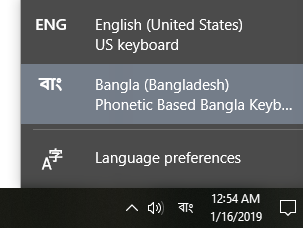

# bangla-keymap
ফোনেটিক বেজড বাংলা কিবোর্ড লে-আউট । এখান থেকে ডাউনলোড করে ইনষ্টল করে নিন। এটি ইনষ্টল করার পর আপনার উইন্ডোজ কম্পিউটারে এই ছবির মতও একটি অপসণ দেখতে পাবেন। এখান থেকে বাংলা অপশনটি সিলেক্ট করে নিলে আপনার কম্পিউটারটি বাংলা লেখার জন্য তৈরি হয়ে যাবে।

### Key Mapping

| বর্ণ → Key | বর্ণ → Key | বর্ণ → Key | বর্ণ → Key | বর্ণ → Key | বর্ণ → Key | বর্ণ → Key |
| - | - | - | - | - | - | - |
| অ → ao | ক → k | ঠ → th | ব → b | ঃ → HH | ৈ → oi | ক্ষ → k+S
| আ → A | খ → kh / K | ড → d | ভ → bh / v | ং → ng | ৌ → ou | হ্ম → H+m / h+m
| ই → I | গ → g | ঢ → dh | ম → m | ঁ → ^ / NN | ্ → + / w | দ্ম → D+m
| ঈ → II | ঘ → gh / G | ণ → N | য → z | ৎ → tt | ৃ → wr | জ্ঞ → j+NG
| উ → U | ঙ → Ng | ত → T | র → r | া → a | - | ঞ্জ → NG+j
| ঊ → UU | চ → c | থ → Th | ল → l | ে → e | - | ষ্ণ → S+N
| ঋ → WR | ছ → ch / C | দ → D | শ → sh | ো → o | - | ফ্ট → f+t
| এ → E | জ → j | ধ → Dh | ষ → S | ি → i | - | হৃ → Hwr / hwr
| ঐ → Oi / OI | ঝ → jh / J | ন → n | স → s | ী → ii | - | হ্ণ → H+N / h+N
| ও → O | ঞ → NG | প → p | হ → h / H | ু → u | - | হ্ন → H+n / h+n
| ঔ → Ou / OU | ট → t | ফ → ph / f | - | ূ → uu | - | ক্স → x / k+s

